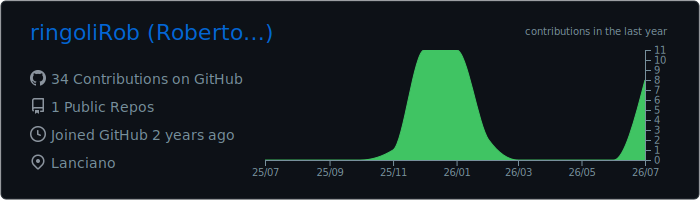

# Hey, I'm Roberto 👋

**Web developer from Italy and Computer Science student, almost at the finish line.**

I like turning half-serious ideas into real things you can open, click, and share.

 

## A bit about me

I'm the kind of person who learns best by building.

Most days you'll find me somewhere between React components, TypeScript errors, and experiments that were supposed to take “just one evening”. I'm currently finishing my Computer Science degree and getting deeper into full-stack development, backend systems, and AI-assisted workflows.

## CAZZEGGIO

### Casual gaming, taken unnecessarily seriously.

**CAZZEGGIO** is my playground for building browser games and interactive challenges. It brings original mini-games, daily challenges, global leaderboards, and a growing community together in one place.

 

## Tools I enjoy using

  

## A few GitHub numbers

