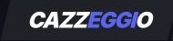

# Hey, I'm Roberto 👋

### Computer Science student from Italy, almost at the finish line.

I like turning half-serious ideas into real things you can open, click, and share.

 

---

## 🏝️ robertoringoli.it

### My portfolio, built as a 3D digital archipelago.

Instead of a traditional project grid, every part of my work lives on its own island. 
The journey starts from my hometown, **Lanciano**, and turns my projects 
and interests into places you can actually explore.

`React` &nbsp;·&nbsp; `TypeScript` &nbsp;·&nbsp; `Three.js`

 

---

## Casual gaming, taken unnecessarily seriously.

**CAZZEGGIO** is my playground for browser games and interactive challenges: 
original mini-games, something new to beat every day, and a community 
fighting over a few positions on the leaderboard.

 

🎮 &nbsp;Original mini-games &nbsp;&nbsp;|&nbsp;&nbsp; 🔥 &nbsp;Daily challenges &nbsp;&nbsp;|&nbsp;&nbsp; 🏆 &nbsp;Global leaderboards

 

